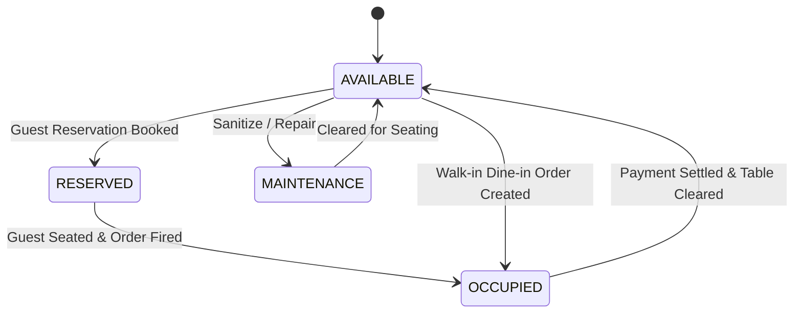

# DineFlow ERP — Core Business Rules & Regulatory Standards

This document formalizes the statutory, operational, and mathematical business rules governing DineFlow.

---

## 1. Indian Taxation & GST Compliance (SAC 9963)

Restaurant service and food dining are governed by **Services Accounting Code (SAC) 996331** under the Indian Goods and Services Tax framework.

### 1.1 Tax Determination Logic
1. **Intra-State Supply (Default)**:
   - When the dining customer and branch reside within the same state (e.g., Telangana):
     $$\text{CGST} = \text{round\_inr}\left(\frac{\text{Taxable Subtotal} \times 0.05}{2}\right) = 2.5\%$$
     $$\text{SGST} = (\text{Taxable Subtotal} \times 0.05) - \text{CGST} = 2.5\%$$
     $$\text{IGST} = 0.00$$
2. **Inter-State Supply**:
   - For inter-state corporate catering or delivery to customer registered outside branch state:
     $$\text{IGST} = \text{round\_inr}(\text{Taxable Subtotal} \times 0.05) = 5.0\%$$
     $$\text{CGST} = 0.00, \quad \text{SGST} = 0.00$$

### 1.2 Statutory Invoice Mandatory Elements
Every issued Tax Invoice must permanently freeze:
- 15-character statutory GSTIN (e.g., `36AAACN1234F1Z9`).
- 14-digit FSSAI Food Safety License Number (e.g., `13624014000189`).
- Itemized line items displaying SAC 9963 code, unit price, quantity, rate of tax, CGST amount, and SGST amount.
- Non-repeating sequential invoice number (e.g., `INV/2026-09/0001`).

---

## 2. POS Dining Floor & Table Lifecycle

Dining tables transition across well-defined lifecycle states:

### Table Turnover Metrics
- **Dining Duration**: Calculated as `order.completed_at - order.created_at`.
- **Target Table Turnover Target**: 60 minutes per table session.
- When an order is placed, the table automatically links to `current_order` and switches status to `OCCUPIED`. When payment is recorded, the table clears to `AVAILABLE`.

---

## 3. Kitchen Display System (KDS) & Prep SLAs

1. **Station Routing**:
   Dishes are dynamically routed based on station tags:
   - `BIRYANI_CURRY`: Biryani, curries, dals, gravies.
   - `TANDOOR_GRILL`: Kebabs, tikkas, naans, rotis.
   - `DOSA_SOUTH`: South Indian tiffins, dosas, idlis.
   - `BEVERAGES`: Mocktails, Irani chai, lassis.
   - `DESSERT`: Qubani ka meetha, double ka meetha.
2. **Delayed KOT Detection**:
   $$\text{Elapsed Minutes} = \text{Floor}(\frac{\text{Current Time} - \text{Start Time}}{60})$$
   $$\text{Is Delayed} = (\text{Status} \notin [\text{READY}, \text{BUMPED}]) \land (\text{Elapsed Minutes} > \text{Expected SLA})$$

---

## 4. Bill of Materials (BOM) & Inventory Auto-Depletion

Every menu item is linked to raw materials via `RecipeItem`:
- Portion recipe: e.g., 1 portion of Hyderabadi Biryani requires `0.350 kg` Basmati Rice, `0.300 kg` Chicken Cut, `0.050 L` Desi Ghee.
- When an order reaches `PREPARING` or `COMPLETED`, inventory is deducted via an immutable `StockMovement` ledger entry (`movement_type = ORDER_CONSUMPTION`).
- Low-Stock Rule:
  $$\text{Is Low Stock} = \text{current\_stock} \le \text{minimum\_stock\_level}$$

---

## 5. Indian Statutory Human Capital & Payroll

DineFlow enforces Indian statutory employment compensation compliance:

### 5.1 Salary Structure Breakdown
- **Basic Salary**: $50\%$ of Gross Monthly Salary.
- **House Rent Allowance (HRA)**: $25\%$ of Gross Monthly Salary.
- **Conveyance Allowance**: Fixed (₹2,000.00).
- **Special Allowance**: Remaining balance of Gross.

### 5.2 Statutory Deductions
1. **Employees' Provident Fund (EPF)**:
   $$12\% \times \min(\text{Basic Salary}, ₹15,000.00) \implies \text{Max } ₹1,800.00/\text{month}$$
2. **Employees' State Insurance (ESIC)**:
   $$\text{If Gross} \le ₹21,000.00 \implies 0.75\% \times \text{Gross}, \quad \text{Else } ₹0.00$$
3. **Professional Tax (PT)**:
   $$₹200.00/\text{month (State statutory slab)}$$
4. **Loss of Pay (LOP)**:
   $$\text{Per Day Rate} = \frac{\text{Gross Monthly Salary}}{30}$$
   $$\text{LOP Deduction} = \text{Per Day Rate} \times \text{Unapproved Absent Days}$$

---

## 6. Cash Register Sessions & Statutory Z-Reports

1. **Shift Opening**: Cashier logs in and records initial opening float cash (default ₹2,000.00 to ₹3,000.00).
2. **Transactions**: All cash payments and operational cash payouts automatically update expected register cash:
   $$\text{Expected Cash} = \text{Opening Float} + \sum \text{Cash Sales} - \sum \text{Cash Expenses}$$
3. **Shift Closing**: Cashier physically counts register cash.
   $$\text{Cash Discrepancy} = \text{Counted Cash} - \text{Expected Cash}$$
   Any variance is logged with cashier signature for manager audit.
4. **Statutory Z-Report**: At end of business day, an immutable Z-Report aggregates all orders, GST totals, discounts, method breakdowns (Cash, Card, UPI), and net revenue.
