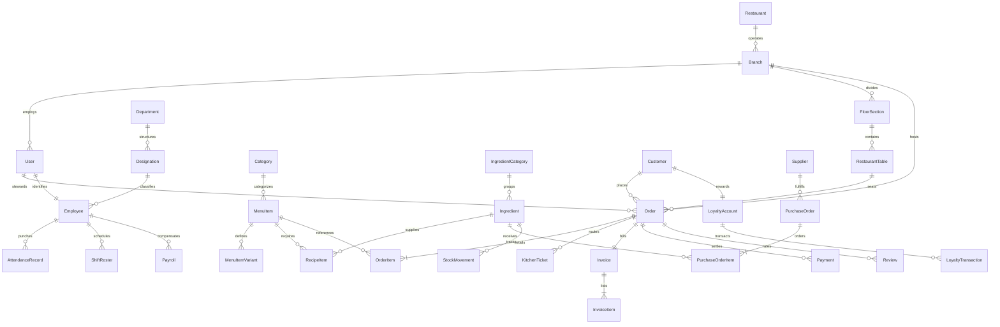

# DineFlow ERP — Database Schema & Entity Relational Architecture

This document describes the relational database schema, key relationships, and data modeling strategies implemented across DineFlow.

---

## 1. Relational Entity Diagram (Core ERD)

---

## 2. Master Entity Dictionary

### 2.1 Multi-Tenancy & Outlets
- **`restaurants_restaurant`**: Corporate legal entity, GSTIN, FSSAI license, registered corporate address.
- **`branches_branch`**: Physical restaurant outlets, city, opening/closing hours, manager reference.
- **`restaurants_restaurantsetting`**: Default GST percentages, invoice prefixes, table turnover targets.

### 2.2 Identity & Role-Based Access
- **`accounts_user`**: Custom enterprise user inheriting `AbstractUser`. Stores `role` (`RoleChoices`), branch/restaurant multi-tenancy FK, account lockout parameters (`failed_login_attempts`, `is_locked`, `locked_until`).

### 2.3 Dining Layout & Floor Plan
- **`tables_floorsection`**: Dining zones (AC Main Hall, Terrace Garden, Nizami PDR, Family Section).
- **`tables_restauranttable`**: Table numbers, seating capacity, current status (`AVAILABLE`, `OCCUPIED`, `RESERVED`, `MAINTENANCE`), active order FK.

### 2.4 Culinary Catalog & Bill of Materials
- **`menu_category`**: Dish categories with sorting order and slug.
- **`menu_menuitem`**: Food dish items, base price, tax rate %, food type (Veg, Non-Veg, Vegan, Egg), spice level.
- **`menu_menuitemvariant`**: Portions (Single, Full, Half, Jumbo).
- **`menu_menuitemaddon`**: Customizations and sides (Extra Cheese, Raita, Salan).
- **`menu_recipeitem`**: Bill of Materials (BOM) linking `MenuItem` to raw `Ingredient` with `quantity_required` and `unit`.

### 2.5 Orders & Kitchen Dispatch
- **`orders_order`**: Core transaction order. Stores `order_number`, `order_type` (Dine-In, Takeaway, Delivery), `status` (`NEW`, `CONFIRMED`, `PREPARING`, `READY`, `COMPLETED`, `CANCELLED`), financial sums (`subtotal`, `tax_amount`, `grand_total`).
- **`orders_orderitem`**: Line items with quantity, unit price, item total, and kitchen notes.
- **`kitchen_kitchenticket`**: Digital KOT routing tickets to specific stations (`BIRYANI_CURRY`, `TANDOOR_GRILL`, `DOSA_SOUTH`, `BEVERAGES`, `DESSERT`) tracking prep SLAs and bump times.

### 2.6 Revenue, Invoicing & Payments
- **`billing_invoice`**: Statutory Indian GST Tax Invoice freezing statutory details (GSTIN, FSSAI, address), taxable subtotal, CGST, SGST, IGST, total tax, and grand total.
- **`billing_invoiceitem`**: Statutory itemized line with SAC Code `996331` and tax rate %.
- **`payments_payment`**: Ledger record storing payment method (UPI, Cash, Card, Split), internal transaction reference (`TXN-UPI-*`), cashier reference, and settlement status.
- **`sales_cashregistersession`**: Cash drawer shift opening float, closing counted cash, and computed discrepancy.
- **`sales_zreport`**: Daily statutory register closure aggregating all payment channels, taxes, and net revenue.

### 2.7 Procurement & Inventory
- **`inventory_ingredient`**: Raw material inventory with current stock level, minimum reorder level, optimal level, and unit cost.
- **`inventory_stockmovement`**: Immutable audit ledger recording stock delta, before/after levels, movement type, and reference ID.
- **`suppliers_supplier`**: Vendor directory, GSTIN, payment terms, bank account, and performance ratings.
- **`purchases_purchaseorder`**: Procurement orders with line items, tax computations, and delivery verification.

### 2.8 Human Capital & Indian Payroll
- **`employees_employee`**: Staff employment profile, PAN number, Aadhaar number, UAN number, bank details, and Indian salary structure (Basic, HRA, Conveyance, Special).
- **`shifts_shiftroster`**: Daily shift assignments linked to employees.
- **`attendance_attendancerecord`**: Daily biometric/punch-in time, punch-out time, status (`PRESENT`, `ABSENT`, `HALF_DAY`, `ON_LEAVE`), and computed total hours.
- **`payroll_payroll`**: Monthly payslips storing gross earnings, statutory EPF (12%), ESIC (0.75%), Professional Tax (₹200), LOP deductions, and net disbursed salary.

### 2.9 Intelligence & Forecasting
- **`ml_prediction_predictionmodelregistry`**: Metadata registry for trained Scikit-Learn RandomForest models (R2 score, MAE, RMSE, artifact path).
- **`ml_prediction_dailydemandforecast`**: 7-day forward demand projections (covers, orders, revenues).
- **`audit_auditlog`**: Immutable security trail recording actor, action, JSON diffs of old and new values, and IP address.
