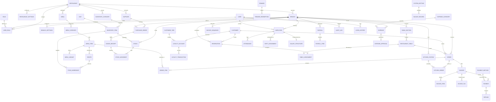

# DineFlow Entity-Relationship (ER) Architecture Diagram

```mermaid
erDiagram
    RESTAURANT ||--o{ BRANCH : "operates"
    RESTAURANT ||--o{ RESTAURANT_SETTINGS : "configures"
    RESTAURANT ||--o{ USER_ROLE : "assigns"
    BRANCH ||--o{ BRANCH_SETTINGS : "configures"
    BRANCH ||--o{ TABLE_SECTION : "contains"
    TABLE_SECTION ||--o{ RESTAURANT_TABLE : "houses"
    BRANCH ||--o{ KITCHEN_STATION : "runs"
    BRANCH ||--o{ EMPLOYEE : "employs"

    USER ||--o{ USER_ROLE : "holds"
    ROLE ||--o{ USER_ROLE : "defined_in"
    USER ||--o{ EMPLOYEE : "profiles"

    RESTAURANT ||--o{ MENU : "publishes"
    MENU ||--o{ MENU_CATEGORY : "categorizes"
    MENU_CATEGORY ||--o{ MENU_ITEM : "lists"
    MENU_ITEM ||--o{ MENU_VARIANT : "offers"
    MENU_ITEM ||--o{ RECIPE : "defined_by"
    RECIPE ||--o{ FOOD_INGREDIENT : "requires"
    INVENTORY_ITEM ||--o{ FOOD_INGREDIENT : "supplies"

    RESTAURANT ||--o{ INVENTORY_CATEGORY : "groups"
    INVENTORY_CATEGORY ||--o{ INVENTORY_ITEM : "classifies"
    UNIT ||--o{ INVENTORY_ITEM : "measures"
    BRANCH ||--o{ STOCK : "holds"
    INVENTORY_ITEM ||--o{ STOCK : "quantifies"
    STOCK ||--o{ STOCK_MOVEMENT : "logs"

    RESTAURANT ||--o{ SUPPLIER : "contracts"
    SUPPLIER ||--o{ PURCHASE_ORDER : "receives"
    BRANCH ||--o{ PURCHASE_ORDER : "places"
    PURCHASE_ORDER ||--o{ GOODS_RECEIPT : "fulfills"
    GOODS_RECEIPT ||--o{ STOCK_MOVEMENT : "inwards"

    BRANCH ||--o{ ORDER : "receives"
    CUSTOMER ||--o{ ORDER : "places"
    RESTAURANT_TABLE ||--o| ORDER : "seats"
    ORDER ||--o{ ORDER_ITEM : "contains"
    MENU_ITEM ||--o{ ORDER_ITEM : "selected_in"
    ORDER ||--o{ KITCHEN_ORDER : "routes_to"
    KITCHEN_STATION ||--o{ KITCHEN_ORDER : "prepares"

    ORDER ||--o| INVOICE : "bills"
    BRANCH ||--o{ INVOICE_SEQUENCE : "allocates"
    INVOICE ||--o{ INVOICE_ITEM : "details"
    INVOICE ||--o{ INVOICE_TAX : "breaks_down"
    INVOICE ||--o{ PAYMENT : "collects"
    PAYMENT_METHOD ||--o{ PAYMENT : "processed_via"
    PAYMENT ||--o{ REFUND : "reverses"

    CUSTOMER ||--o| LOYALTY_ACCOUNT : "maintains"
    CUSTOMER_TIER ||--o{ LOYALTY_ACCOUNT : "assigns"
    LOYALTY_ACCOUNT ||--o{ LOYALTY_TRANSACTION : "records"
    REWARD ||--o{ REWARD_REDEMPTION : "claims"

    CUSTOMER ||--o{ RESERVATION : "books"
    BRANCH ||--o{ RESERVATION : "schedules"
    RESERVATION ||--o| TABLE_ASSIGNMENT : "occupies"
    RESTAURANT_TABLE ||--o| TABLE_ASSIGNMENT : "allocated_to"

    EMPLOYEE ||--o{ ATTENDANCE : "logs"
    EMPLOYEE ||--o{ SHIFT_ASSIGNMENT : "scheduled_for"
    EMPLOYEE ||--o| SALARY_STRUCTURE : "compensated_by"
    BRANCH ||--o{ PAYROLL : "disburses"
    PAYROLL ||--o{ PAYROLL_ITEM : "itemizes"

    BRANCH ||--o{ EXPENSE : "incurs"
    EXPENSE_CATEGORY ||--o{ EXPENSE : "classifies"
    EXPENSE ||--o| EXPENSE_APPROVAL : "authorizes"

    USER ||--o{ AUDIT_LOG : "triggers"
    USER ||--o{ LOGIN_HISTORY : "logs"
    SYSTEM_SETTING ||--o{ BACKUP_RECORD : "catalogs"
```
